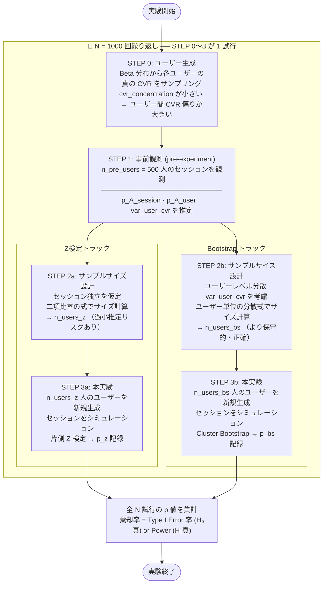

# exp-bootstrap-ab-testing

**母比率の差の検定** をテーマにしたABテストシミュレーション実験リポジトリです。  
Bootstrap検定と通常の母比率の差の検定を、複数の実験条件下で比較・評価します。

---

## 概要

ABテストにおける統計的検定手法の妥当性を、シミュレーションによって検証します。  
特に以下の2つの検定手法を比較します。

| 検定手法 | 概要 |
|---|---|
| **通常の母比率の差の検定** | `z`検定による漸近理論に基づいた検定 |
| **Bootstrap検定** | リサンプリングによるノンパラメトリックな検定 |

### 検証する実験条件

| 条件 | 説明 |
|---|---|
| **試行ごとに相関がある場合** | ユーザー内に繰り返し観測があり、観測間に正の相関が存在するシナリオ（例：同一ユーザーの複数セッション） |
| **ユーザー数に差がある場合** | コントロール群とトリートメント群でサンプルサイズが異なるシナリオ（不均等割り付け） |
| **実務に近い設定（power_calibrated）** | AB分割前の事前観測データからCVRを推定し、Z検定は独立仮定でサンプル数を設計（セッション単位）、Bootstrapはユーザーレベル分散でサンプル数を設計（ユーザー単位）。各手法が自分の仮定でサイズを決めて実験した場合でも、Z検定の第一種過誤率がインフレすることを検証する |

---

## 実験インターフェース

実験は以下の流れで `N` 回繰り返します。

```
for i in range(N):
    1. ユーザープロファイルを生成
       （cvr_concentration を基に、各ユーザーの基本コンバージョン確率を生成）
    2. ユーザーを A群 / B群 にランダム分割 (AB splitting)
    3. 分割されたデータとパラメータ（repeat_multiplier 等）を基に、コンバージョン（0/1）をシミュレーション
    4. 通常の母比率の差の検定 → p値を記録
    5. Bootstrap検定 → p値を記録

→ N回の検定結果を集計し、第一種過誤率・検出力などを評価
```

パラメータはYAML設定ファイル、またはコマンドライン引数で指定可能です。

---

## データ保持形式

シミュレーション内では、ユーザープロファイルとセッション（コンバージョン挙動）データをそれぞれ以下のデータ構造（Pandas DataFrame）として保持します。

### 1. ユーザープロファイルデータ (User Profiles)
ユーザーごとの固定情報や基本となるコンバージョン確率を管理します。

| カラム名 | データ型 | 説明 |
|---|---|---|
| `user_id` | `str` | ユーザーのユニークID (例: `U000001`) |
| `group` | `str` | 割り付けグループ (`A` または `B`) |
| `base_cvr` | `float` | ベータ分布からサンプリングされたユーザー固有のベースコンバージョン確率 |

### 2. セッションログデータ (Session Logs)
ユーザーがアクセス（セッション）した際のコンバージョン結果を記録します。1人のユーザーが複数回アクセスするため、1ユーザーに対して複数行のレコードが生成されます。

| カラム名 | データ型 | 説明 |
|---|---|---|
| `user_id` | `str` | ユーザーID |
| `session_index` | `int` | ユーザーごとのアクセス回数（0から始まるインデックス。`repeat_multiplier` の判定に利用） |
| `group` | `str` | 割り付けグループ (`A` または `B`) |
| `cvr` | `float` | そのセッションに適用されたコンバージョン確率（ベースCVRに `relative_uplift` や `repeat_multiplier` を掛け合わせた最終確率） |
| `conversion` | `int` | コンバージョン有無のダミー変数 (`0` または `1`。確率 `cvr` のベルヌーイ試行の結果) |

---

## 設定ファイル (YAML)

シミュレーションのパラメータは、YAML形式の設定ファイルで管理・指定することができます。

### 設定ファイルの例 (`configs/default.yaml`)

```yaml
n_trials: 1000             # ABテストシミュレーションの繰り返し回数 N
scenario: "correlated"     # 実験条件 (correlated / imbalanced / baseline)
n_users: 200               # 実験に使用する総ユーザー数（power_calibrated時は自動計算）
sessions_per_user: 5        # 1ユーザーあたりの平均セッション数 (アクセス回数)
split_ratio: 0.5           # A群:B群の割り付け比率 (imbalanced時に有効)
rho: 0.3                   # 観測間の相関係数 (correlated時に有効)
cvr_concentration: 10000.0  # ユーザー間CVRの集中度 (値が小さいほど偏りが大きく、10000等でほぼ一様)
repeat_multiplier: 1.0     # 2回目以降のCVR倍率 (1.0で変化なし、1.5で1.5倍に上昇)
base_rate: 0.1             # ベースコンバージョン率 (A群)
relative_uplift: 0.0       # 手法Bの手法Aに対する相対的な改善率 (0.0のとき帰無仮説が真)
alpha: 0.05                # 有意水準
bootstrap_iter: 1000       # Bootstrapリサンプリング回数
seed: 42                   # 乱数シード
output_dir: "./results"    # 結果の出力先ディレクトリ

# power_calibrated シナリオ用オプション（CLIのみ指定可能）
# --mde 0.2          既知の介入改善幅（例: 0.2 = 20%）。指定するとサンプル数を自動計算
# --target_power 0.8 目標検出力（デフォルト: 0.8）
# --n_pre_users 500  事前観測フェーズのユーザー数（デフォルト: 500）
# --one_sided        片側検定フラグ（B > A 方向）
```

---

## ディレクトリ構成（予定）

```
exp-bootstrap-ab-testing/
├── README.md
├── Dockerfile
├── docker-compose.yml
├── requirements.txt
├── configs/
│   └── default.yaml           # 実験設定ファイル (YAML)
├── src/
│   ├── simulation.py          # シミュレーション本体（N回ループ）
│   ├── tests/
│   │   ├── z_test.py          # 通常の母比率の差の検定
│   │   └── bootstrap_test.py  # Bootstrap検定
│   ├── scenarios/
│   │   ├── correlated.py      # 観測間に相関がある場合
│   │   ├── imbalanced.py      # ユーザー数に差がある場合
│   │   └── pre_experiment.py  # 事前観測フェーズのデータ生成（power_calibrated用）
│   └── utils.py               # 共通ユーティリティ（サンプル数計算関数を含む）
├── results/                   # 実験結果の出力先
└── scripts/
    └── run_experiment.sh      # 実験実行スクリプト
```

---

## 環境構築

> [!IMPORTANT]
> **本シミュレーションの実行（スクリプト、テスト、結果の評価等）は、再現性を100%担保するため、必ずDockerコンテナ上で実行してください。**  
> ローカル環境（ホストマシン）に直接Pythonパッケージをインストールして直接実行することは厳禁です。詳細は [rules.md](file:///Users/masashiueno/Desktop/exp-bootstrap-ab-testing/rules.md) を参照してください。

### 前提条件

- Docker >= 24.0
- Docker Compose >= 2.0

### セットアップ

```bash
# リポジトリのクローン
git clone https://github.com/NamelessOgya/exp-bootstrap-ab-testing.git
cd exp-bootstrap-ab-testing

# Dockerイメージのビルド
docker compose build
```

---

## 実験の実行

### 設定ファイルを使用した実行方法

```bash
# YAML設定ファイルを指定して実行
docker compose run --rm simulation --config configs/default.yaml
```

### コマンドライン引数でパラメータを上書きして実行

YAML設定ファイルをベースにしつつ、特定のパラメータのみコマンドライン引数で上書きして実行することも可能です。

```bash
# 特定のシナリオやパラメータのみを上書きして実行
docker compose run --rm simulation \
  --config configs/default.yaml \
  --scenario imbalanced \
  --split_ratio 0.8
```

### 全条件の一括実行

```bash
# すべてのシナリオを一括実行
docker compose run --rm --entrypoint bash simulation scripts/run_experiment.sh

# 動作確認用の軽量テスト実行
docker compose run --rm --entrypoint bash simulation scripts/run_experiment.sh --test
```

#### 一括実行フロー図

```mermaid
graph TD
    Start([run_experiment.sh 起動]) --> CheckTest{--test 引数?}
    CheckTest -- Yes --> SetTest["テストモード<br/>n_trials=5 / bootstrap_iter=50"]
    CheckTest -- No  --> SetDefault["デフォルト<br/>n_trials=1000 / bootstrap_iter=1000"]
    SetTest    --> GenTS
    SetDefault --> GenTS["バッチフォルダ生成<br/>results/batch_YYYYMMDD_HHMMSS/"]

    GenTS --> MainBlock

    subgraph MainBlock ["メインシナリオ ─ 全て事前サンプルでサンプル数設計"]
        direction TB
        C1["1. baseline_pc_type1_error<br/>IIDデータ · H₀真<br/>scenario=baseline, uplift=0.0"]
        C2["2. baseline_pc_power<br/>IIDデータ · H₁真<br/>scenario=baseline, uplift=0.2"]
        C3["3. power_calibrated_type1_error<br/>相関ありデータ · H₀真<br/>scenario=correlated, uplift=0.0"]
        C4["4. power_calibrated_power<br/>相関ありデータ · H₁真<br/>scenario=correlated, uplift=0.2"]
        C1 --> C2 --> C3 --> C4
    end

    MainBlock --> SweepBlock

    subgraph SweepBlock ["CVR集中度スイープ ─ ユーザー間CVR分散の影響を検証"]
        direction TB
        SW1["5–8. Type I Error スイープ<br/>relative_uplift=0.0<br/>cvr_concentration = 2 / 10 / 100 / 1000"]
        SW2["9–12. Power スイープ<br/>relative_uplift=0.2<br/>cvr_concentration = 2 / 10 / 100 / 1000"]
        SW1 --> SW2
    end

    SweepBlock --> PlotScript["plot_summary.py<br/>─ 可視化スクリプト"]

    PlotScript --> O1["summary_comparison.png<br/>Type I Error · Power 比較"]
    PlotScript --> O2["cvr_sweep.png<br/>Type I / II Error vs CVR集中度"]
    PlotScript --> O3["sample_size.png<br/>手法別 必要サンプル数"]

    O1 & O2 & O3 --> Done([完了])

    C1 & C2 & C3 & C4 -. simulation.py を呼び出し .- SimBox

    subgraph SimBox ["simulation.py 内部フロー（power_calibrated）"]
        direction LR
        P1["STEP 1: 事前観測<br/>n_pre_users=500 で pre-experiment<br/>セッション・ユーザーレベル CVR を測定"]
        P2a["STEP 2a: Z検定 サイズ設計<br/>セッション独立を仮定<br/>n_sessions → n_users_z"]
        P2b["STEP 2b: Bootstrap サイズ設計<br/>ユーザー分散を考慮<br/>var_user_cvr → n_users_bs"]
        P3a["STEP 3a: Z検定 実施<br/>n_users_z 人で実験"]
        P3b["STEP 3b: Bootstrap 実施<br/>n_users_bs 人で実験"]
        PR["p値を記録<br/>N回繰り返し後<br/>棄却率を集計"]
        P1 --> P2a & P2b
        P2a --> P3a
        P2b --> P3b
        P3a & P3b --> PR
    end
```

---

#### power_calibrated フロー詳細

STEP 0（ユーザー生成）〜 STEP 3（本実験）を **1 試行** とし、N = 1000 回繰り返します。
Z検定・Bootstrap は独立したトラックで並列に表示しています。



---

## 出力と評価指標

実験結果は `results/` ディレクトリに保存されます。

### 出力ファイル

#### 単体実行の場合のフォルダ構成
```
results/
└── {scenario}_{timestamp}/
    ├── summary.json           # 集計指標（第一種過誤率・検出力など）
    ├── pvalues_ztest.csv      # 各試行のz検定p値
    ├── pvalues_bootstrap.csv  # 各試行のBootstrap検定p値
    └── figures/
        ├── pvalue_distribution.png   # p値の分布
        ├── power_curve.png           # 検出力曲線
        ├── bootstrap_vs_theory.png   # 比率の差のサンプリング分布比較 (Z検定理論分布 vs Bootstrap経験分布)
        └── user_cvr_distribution.png # ユーザー固有のベースCVRの分布 (A/B群別)
```

#### 一括実行（`run_experiment.sh`）の場合のフォルダ構成
一括実行用の共通親フォルダが作成され、その配下に条件別の結果が格納されます。
```
results/
└── batch_{timestamp}/
    ├── experiment_config.yaml              # 実験実行時の設定ファイル
    ├── summary_comparison.png              # メインシナリオの Type I Error / Power 比較
    ├── cvr_sweep.png                       # CVR集中度スイープ（Type I / II Error）
    ├── sample_size.png                     # 手法別 必要サンプル数の分布比較
    │
    ├── baseline_pc_type1_error/            # IIDデータ + 事前設計 (H0真)
    ├── baseline_pc_power/                  # IIDデータ + 事前設計 (H1真)
    ├── power_calibrated_type1_error/       # 相関ありデータ + 事前設計 (H0真)
    │   ├── summary.json                    # 集計指標・サンプル数情報
    │   ├── pvalues_ztest.csv
    │   ├── pvalues_bootstrap.csv
    │   ├── sample_sizes.csv                # 各試行の n_users_z / n_users_bs
    │   └── figures/
    │       ├── pvalue_distribution.png
    │       ├── power_curve.png
    │       ├── bootstrap_vs_theory.png
    │       └── user_cvr_distribution.png
    ├── power_calibrated_power/             # 相関ありデータ + 事前設計 (H1真)
    │
    ├── cvr_sweep_2/                        # Type I Error: cvr_concentration=2.0
    ├── cvr_sweep_10/                       # Type I Error: cvr_concentration=10.0
    ├── cvr_sweep_100/                      # Type I Error: cvr_concentration=100.0
    ├── cvr_sweep_1000/                     # Type I Error: cvr_concentration=1000.0
    ├── cvr_sweep_2_power/                  # Power: cvr_concentration=2.0
    ├── cvr_sweep_10_power/                 # Power: cvr_concentration=10.0
    ├── cvr_sweep_100_power/                # Power: cvr_concentration=100.0
    └── cvr_sweep_1000_power/               # Power: cvr_concentration=1000.0
```

### 評価指標

| 指標 | 説明 |
|---|---|
| **第一種過誤率 (α error)** | 帰無仮説が真のとき、誤って棄却する割合（`relative_uplift=0.0` で測定） |
| **検出力 (Power)** | 帰無仮説が偽のとき、正しく棄却できる割合 |
| **p値の分布** | 有効な検定ならば一様分布 `Uniform(0,1)` に従うことを確認 |

---

## 実験設計の詳細

### 条件1：試行ごとに相関がある場合（`correlated`）

同一ユーザーに対して複数回の試行（例：ページ訪問）があり、各ユーザーの観測値間に相関が存在するシナリオです。

- **生成モデル**：ベータ-二項モデルでユーザー効果（ランダム効果）を導入。`cvr_concentration` によるユーザー間CVR偏りと、`repeat_multiplier` による2回目以降の行動変化をモデル化します。
- **検証観点**：観測間の相関を無視したZ検定が第一種過誤率を過剰に膨らませることを確認し、Bootstrapが頑健であるかを検証する

#### データ生成モデルの数式

**① ユーザーCVRの生成（Beta-Binomial モデル）**

各ユーザー $i$ のベースCVR をベータ分布からサンプリング：

$$\text{base\_cvr}_i \sim \mathrm{Beta}(\alpha,\ \beta), \qquad \alpha = p_0 \cdot \kappa, \quad \beta = (1 - p_0) \cdot \kappa$$

| 記号 | パラメータ | 説明 |
|:---:|:---:|---|
| $p_0$ | `base_rate` | 全体の平均CVR（デフォルト 0.1） |
| $\kappa$ | `cvr_concentration` | 集中度パラメータ。大きいほどユーザー間CVRが均一 |

この分布の期待値と分散：

$$E[\text{base\_cvr}_i] = p_0, \qquad \mathrm{Var}[\text{base\_cvr}_i] = \frac{p_0\,(1-p_0)}{\kappa + 1}$$

> $\kappa$ が小さい → ユーザー間CVR分散が大きい → Z検定の「セッション独立」仮定が崩れやすい  
> $\kappa \to \infty$ → 全ユーザーが同じCVR（IID、baselineに相当）

**② セッションCVRの決定**

$$\text{cvr}_{i,s} = \begin{cases} \min\!\bigl(\text{base\_cvr}_i \cdot (1 + \Delta),\ 1\bigr) & s = 0\ \text{かつ group} = B \\ \min\!\bigl(\text{base\_cvr}_i \cdot r,\ 1\bigr) & s \geq 1 \\ \text{base\_cvr}_i & \text{otherwise} \end{cases}$$

| 記号 | パラメータ | 説明 |
|:---:|:---:|---|
| $\Delta$ | `relative_uplift` | B群への相対的CVR改善率 |
| $r$ | `repeat_multiplier` | 2回目以降セッションのCVR変動倍率 |
| $s$ | — | セッションインデックス（0起算） |

**③ コンバージョンの生成**

$$\text{conversion}_{i,s} \sim \mathrm{Bernoulli}\!\left(\text{cvr}_{i,s}\right)$$


### 条件2：ユーザー数に差がある場合（`imbalanced`）

A群とB群のサンプルサイズが大きく異なるシナリオです（例：A群80%・B群20%の割り付け）。

- **検証観点**：不均等割り付け下での両手法の検出力と第一種過誤率を比較し、サンプルサイズ不均衡に対する頑健性を評価する

### 条件3：実務に近い設定（`power_calibrated`）

実際のABテスト運用フローを模倣した最も現実的なシナリオです。

**実験フロー：**

```
[STEP 1] 事前観測（n_pre_users ユーザー分、AB分割なし）
          ↓
          Z検定用:    p_A_session = Σconv / Σsessions   ← セッション独立仮定
          Bootstrap用: var_user   = Var(user-cvr)       ← ユーザーレベル分散

[STEP 2a] Z検定のサンプル数設計（片側α=0.05、セッション独立仮定）
          n_sessions_per_group → n_users_z = ceil(n_sessions × 2 / sessions_per_user)
          ※ ここで「情報量の水増し」が発生する

[STEP 2b] Bootstrapのサンプル数設計（片側α=0.05、ユーザー独立仮定）
          ユーザーレベルCVR分散から n_users_bs を直接計算
          → n_users_bs > n_users_z となる（正しく多めに見積もる）

[STEP 3a] Z検定実験：n_users_z ユーザーで相関ありデータ生成 → 片側Z検定
[STEP 3b] Bootstrap実験：n_users_bs ユーザーで相関ありデータ生成 → 片側Bootstrap
```

**検証観点：** 各手法が自分の仮定に従ったサンプル数で実験を行った場合でも、Z検定の第一種過誤率はインフレし（セッションを独立と扱う検定ロジックの問題）、Bootstrapは正しく 5% に制御されることを確認する。

---

## 技術スタック

| カテゴリ | ライブラリ |
|---|---|
| 統計検定 | `scipy`, `statsmodels` |
| Bootstrap処理 | `numpy` |
| 可視化 | `matplotlib`, `seaborn` |
| データ操作 | `pandas` |
| 実験管理 | `argparse`, `PyYAML`, `json` |
| 環境 | `Docker`, `Docker Compose` |

---

## ライセンス

MIT License
